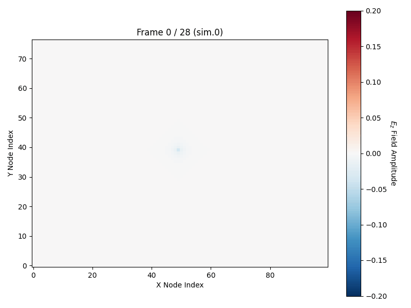
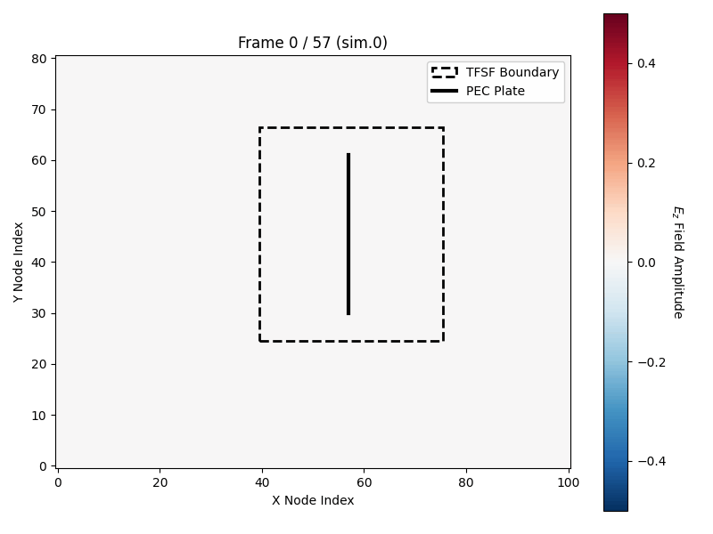

<!-- 


 -->

A high-performance computational electromagnetics framework developed in C.

<!-- This repository currently implements the **2D $\text{TM}_z$ core simulation module**, serving as the foundation for an expanding electromagnetic solver built to analyze plane wave scattering, boundary conditions, and complex target geometries. -->


<table>
  <tr>
    <td style="text-align: center;" width="50%">
      
      <br />
      <b>2D Resonator Mode</b>
      <br />
      <i>Point source pulse injected in grid center with surrounding PEC boundaries acting as a resonant cavity.</i>
    </td>
    <td style="text-align: center;" width="50%">
      
      <br />
      <b>2D TFSF Plane Wave Scattering</b>
      <br />
      <i>Incident $E_z$ wave injected via TFSF boundary, scattering off a central PEC plate target.</i>
    </td>
  </tr>
</table>

---

# Electromagnetic FDTD Simulation Engine

## Simulation Modules & Visualizations

## Electromagnetic Physics & Field Vectors

This module solves Maxwell's curl equations for **Transverse Magnetic ($\text{TM}_z$)** polarization in a 2D Yee grid space.

### 1. Active Field Components
In $\text{TM}_z$ mode, the field vector components are defined as:
* **Electric Field:** $\vec{E} = (0,\, 0,\, E_z)$ (Oriented perpendicular to the grid plane)
* **Magnetic Field:** $\vec{H} = (H_x,\, H_y,\, 0)$ (Oriented within the grid plane)

### 2. Incident Wave Propagation
In the TFSF module, the 1D auxiliary grid injects a uniform plane wave traveling from **Left to Right** along the positive X-axis ($+\hat{x}$):
* **Propagation Vector ($\vec{k}$):** $+\hat{x}$
* **Electric Field ($E_z$):** $+\hat{z}$ (Rendered in **Red** for $+E_z$ and **Blue** for $-E_z$)
* **Magnetic Field ($H_y$):** $+\hat{y}$ (Points vertically UP along $+Y$)
* **Poynting Vector ($\vec{S}$):** Dictates directional energy flux:
  $$\vec{S} = \vec{E} \times \vec{H} = (E_z \hat{z}) \times (H_y \hat{y}) = -E_z H_y \hat{x}$$

---

## System Architecture & Features

* **C Simulation Engine:** Solves Maxwell's update equations using staggered leapfrog time stepping.
* **TFSF Virtual Boundary:** Separates the solution domain into a Total Field region (incident + scattered fields) and a Scattered Field region (scattered fields only).
* **PEC Boundary Conditions:** Enforces conductive interface constraints by clamping tangential electric fields ($E_z = 0$).
* **Direct Binary Serialization:** Streams raw grid snapshots directly to disk (`sim.0`, `sim.1`, ...) for lightweight computational overhead.
* **Automated Python Pipeline:** Reads row-major binary streams, aligns spatial axes, applies visual boundary overlays, and auto-exports animated graphics inside `images/` directories.

---

## Directory Structure

```text
├── 2d_fdtd/                 # Point source pulse inside PEC boundary cavity
│   ├── images/
│   │   └── fdtd_simulation.gif
│   ├── include/
│   ├── src/
│   └── plot_data.py
├── 2d_fdtd_with_tfsf/       # TFSF plane wave scattering off PEC plate target
│   ├── images/
│   │   └── fdtd_simulation.gif
│   ├── include/
│   ├── src/
│   └── plot_data.py
    ├── 3d_fdtd_with_tfsf/       # 3D grid simualion
│   ├
│   │ 
│   ├── include/
│   ├── src/
│   └── plot_data.py
├── .gitignore
└── README.md


## referemces

Understanding the Finite-Difference Time-Domain Method, John B. Schneider, www.eecs.wsu.edu/~schneidj/ufdtd, 2010